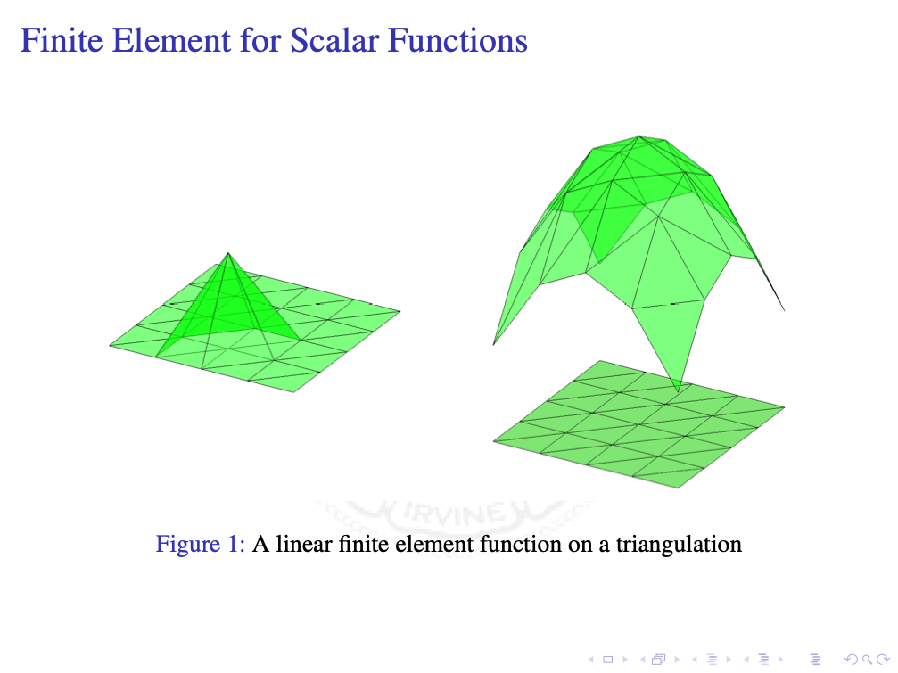

We use Lagrange elements as an example to introduce the simplicial lattice and construction of finite elements based on a decomposition of the simplicial lattice. Brief explanation will be given after some slides. Proofs included in the slides are short and less rigorous. The readers are encouraged to read the reference for all details.

**Reference**: [Geometric decompositions of the simplicial lattice and smooth finite elements in arbitrary dimension](https://arxiv.org/abs/2111.10712) Long Chen and Xuehai Huang. *arXiv.* 2021.

